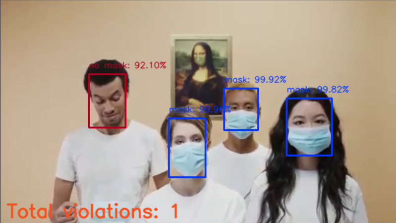

# Real time Face Mask detector
##### with OpenCV, Keras (Tensorflow backend) and Python

Detect face-masks in real-time camera stream



## Description

#### Usage

To run the program with live webcam stream:
```shell
python mask-detector.py
```

To run the program with custom source file (e.g. an mp4 video file):
```shell
python mask-detector.py --source videoplayback.mp4
```

Hit `Esc` key to exit the program at any time.

#### Dependencies

The project is built using these libraries:

Tensorflow 2.1  
Keras 2.3  
Numpy 1.19  
OpenCV 4.5  
Matplotlib 3.3 (for testing only)  

Python 3.6 is used.

#### Dataset

The dataset for training the mask detection model is available here:

https://www.kaggle.com/omkargurav/face-mask-dataset

The dataset directory structure is modified in this format:

* data
    * train
       * 1_without_mask -> contains 2828 images
       * 2_with_mask -> contains 2725 images
    * test
       * 1_without_mask -> contains 1000 images
       * 2_with_mask -> contains 1000 images


---

Created by Dharmveer Bharti  
Under Computer Vision and Internet of Things Internship  
by The Sparks Foundation  

---